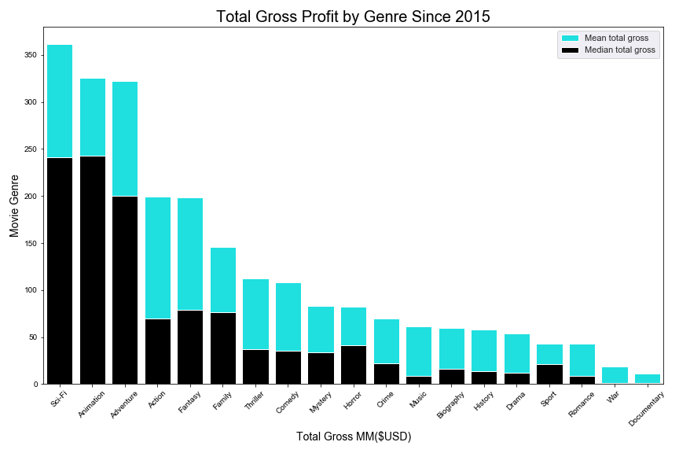
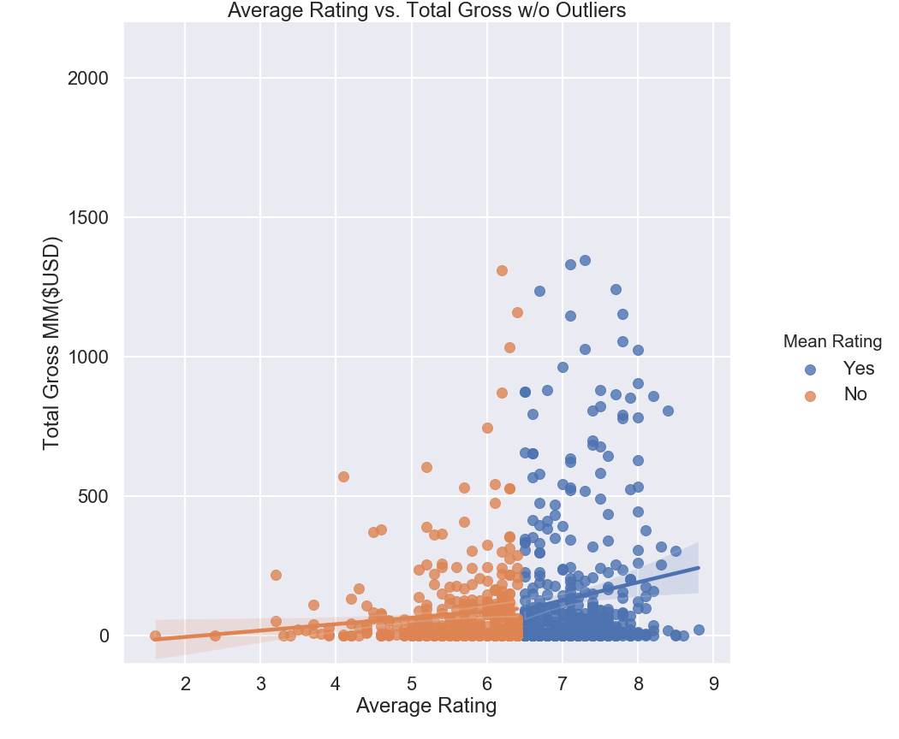

# Profibility drivers for Movies 2015 to present

**Authors**: Eric Roberts, Justin Williams

## Overview

A one-paragraph overview of the project, including the business problem, data, methods, results and recommendations.

## Business Problem

Microsoft is looking to create their own movie content. They need to know what factors are currently driving success at the box office. Our overarching goal is to determine why movies are doing well, and make reccomendations for the Microsoft team.

***
Questions:
* What genre of movies are most profitable?
* What is the optimal time of year to maximize profits?
* What is the relationship between audience perception and profitability?
***

## Data

The data being used for this project came from a multitude of sources:
* Box Office Mojo
* IMDB
* TheMovieDB.org

__Notes:__ 
_Box Office Mojo by IMDbPro receives data from a variety of sources, including film studios, distributors, sales agents, and others from around the world._
_The Movie Database (TMDb) is a community built movie and TV database. Every piece of data has been added by their community dating back to 2008._

The following datapoints where operationalized as:

* Profitability - total, domestic and foreign gross. 
* Seasonality - time of year as month. 
* Genre - type of genre defined by [IMDB tags](https://help.imdb.com/article/contribution/titles/genres/GZDRMS6R742JRGAG#)
* Audience perception - average user rating

Datapoints most prominently utilized in our analysis were:
* Domestic, Foreign and Total Gross - reported in $USD modeled continously
* Release date - reported by MM/DD/YYYY of original theater release date modeled categorically
* Genre - modeled categorically
* Average Rating - 10 point likert modeled continously

## Methods

Descriptive statistics and histograms were created for continous variables to identify outliers and missing values. Once these were identified, appropiate action was taken to remove or transform to facilitate analysis. Value counts were calculated for categorical variables to assess distributions, cell counts and missing values. Categories were excluded or collapsed as necessary as detailed in our Jupyter Notebook. Our final analysis consisted of various visualizations addressing our three key questions of interest. Scatterplots were utilized when the variables were both continous, and barcharts used when summarizing continious variables across categories. 

## Results

Present your key results. For Phase 1, this will be findings from your descriptive analysis.

***
Questions to consider:
* How do you interpret the results?
* How confident are you that your results would generalize beyond the data you have?
***

### Figure 1


* Sci-Fi, Animation and Adventure have median gross profits > 200 million
* Action and Fantasy have mean gross profits > 200 million with median < 100 million
* Sport, Romance, War and Documentaries were the least profitable with < 50 million mean 

### Figure 2


Four cross-classified categories were significantly more profitable then the rest.

These were:
* Action, Adventure, Sci-Fi
* Action, Adventure, Fantasy
* Adventure, Animation, Comedy
* Action, Adventure, Comedy

### Figure 3


* July, June, May and November respectively proved to be the most profitable months for movie release.
* September, October, January and August respectively proved to be the least profitable. 

### Figure 4

### Figure 5


We hypothesized that there was a positive relationship between average rating and gross profit below the mean, and no relationship between average rating and gross profit above the mean. This was not the case as demonstrated by the overlayed linear regressioned subdivided by average ratings. Above and below the mean there was a positive linear relationship to profitability which was stronger above the mean. To assess the sensitivity of these results we removed the top/bottom 5 grossing movies, and the results did not change substantively.

***
There are several caveats to consider in our results which should prevent over interpretation. 
1. The Movie Database is user generated therefore it may not be entirely comprehensive. If it excludes important movies released in certain months, our findings may be biased. 
2. IMDB and BOM colate data from a variety of sources, if data was not collected in a consistent manner it could skew results in different directions. 
_For example:_
* If studios report gross figures diffferently, and tend to produce differing genres of film, that may partially account for reported levels of profitability.
3. There are likely unmeasured variables that are related to profitability such as director, actor, awards, script quality etc. 

***
## Conclusions

Provide your conclusions about the work you've done, including any limitations or next steps.

__Key insights:__
* Multi-genre films that include Action and Adventure proved to be the most profitable
* Individually, Sci-Fi, Animation and Adventure were the most profitable
* Early Summer releases are the most profitable, followed closely by the Holiday season.
* Audience perception matters

__Limitations:__
* There are other factors that merit investigation that influence overall profitability such as:
    - director
    - actor
    - awards
    - script quality

__Next Steps:__
* Future analysis should investigate how the above factors are related to audience perception and profitabilty. 

## For More Information

Please review our full analysis in [our Jupyter Notebook](./profitability_drivers_movies_2015_present.ipynb) or our [presentation](./DS_Project_Presentation.pdf).

For any additional questions, please contact **name & email, name & email**

## Repository Structure

Describe the structure of your repository and its contents, for example:

```
├── README.md                           <- The top-level README for reviewers of this project
├── profitability_drivers_movies_2015_present.ipynb   <- Narrative documentation of analysis in Jupyter NB
├── DS_Project_Presentation.pdf         <- PDF version of project presentation
├── Data                                <- Both sourced externally and generated from code
└── images                              <- Both sourced externally and generated from code
```
